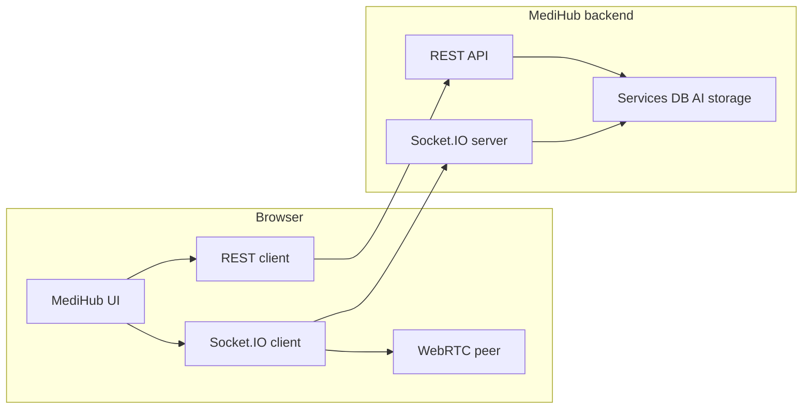

# MediHub Frontend API Guide

This frontend is separate from the MediHub backend repository. The backend server URL must be stored in this frontend project's own `.env` file.

**Base URL in this doc:** Endpoint lines use `<process.env.MEDIHUB_SERVER>` as a generic placeholder. In this Vite app, that is **`import.meta.env.VITE_MEDIHUB_SERVER`** (see **Environment Setup** and `getMedihubServer()` in `src/lib/config.ts`).

## Application architecture

This section describes how the MediHub **browser app** is expected to be structured and how it talks to the backend documented below. The repository may start as API documentation only; when you scaffold the UI, align folders and routes with this map so features stay traceable to endpoints.

### System context

The frontend is a **single-page or app-router web client** that:

- Calls the **MediHub REST API** on your configured server base URL (`/api/...`).
- Uses **`credentials: "include"`** on protected `fetch` calls so HTTP-only auth cookies work.
- Opens a **Socket.IO** connection to the **same host** for WebRTC signaling during live consultations.

Third-party API keys (`GOOGLE_PLACES_API_KEY`, `GEMINI_API_KEY`, Cloudinary signing secrets, JWT secrets, database URIs) stay on the **backend** and are **not used in this frontend** — there are no `VITE_*` entries for them in `.env.example`, and the client does not read map or AI provider keys. The browser only needs **`VITE_MEDIHUB_SERVER`** (and optional path/OAuth/video/WebRTC env overrides; see **Environment Setup**). When hospital locator is implemented, map config should come from backend routes such as `GET /api/hospital-locator/map-config`, not from frontend env keys.



### User roles and surfaces

| Role | Primary goals | Main API areas |
| --- | --- | --- |
| **Guest** | Discover doctors, tools, hospitals; register or log in | Public APIs, Authentication |
| **Patient** | Profile, book visits, upload reports, AI assistant, join video consult | Protected User, Appointments, AI Chat, WebRTC |
| **Doctor** | Profile and verification docs, slots, notes, prescriptions, AI draft, video | Doctor, Appointments, AI Chat, WebRTC |
| **Admin** | Review and verify doctor submissions | Doctor admin endpoints under Doctor APIs |

Route guards should match **cookie/session auth** (and **`Authorization: Bearer`** when the client stores a token from login/register) and **`role`** from `/api/users/me` (and doctor-specific `/api/doctors/me` where applicable).

### Information architecture (routes and features)

Group navigation into **feature modules**. Names are suggestions; adjust to your router (React Router, Next.js App Router, etc.).

| Area | Suggested routes (examples) | Backend alignment |
| --- | --- | --- |
| **Marketing / public** | `/`, `/about` | Optional static |
| **BMI Buddy** | `/tools/bmi` | `GET /api/bmi-buddy`, `POST /api/bmi-buddy/calculate` |
| **Doctors** | `/doctors`, `/doctors/:id` | `GET /api/doctors`, slots under Appointments |
| **Hospitals** | `/hospitals`, `/hospitals/map` | Hospital locator + map-config + photo proxy |
| **Auth** | `/login`, `/register/patient` \| `/register/doctor` \| `/register/admin` (`/register` redirects) | Authentication APIs |
| **Account** | `/account`, `/account/security` | Protected User APIs |
| **Patient appointments** | `/appointments`, `/appointments/:id`, `/book/:doctorId` | Appointment APIs (book, reports, symptoms) |
| **Doctor workspace** | `/doctor`, `/doctor/schedule`, `/doctor/appointments/:id` | Doctor + Appointment doctor flows |
| **Admin** | `/admin/doctors/pending` | Doctor admin verify |
| **AI assistant** | `/ai`, `/ai/:chatId` | AI Chat APIs |
| **Consultation room** | `/consult/:appointmentId` | Socket.IO + WebRTC events |

Keep **consultation** routes thin: load appointment details over REST, then join the Socket.IO room and run the WebRTC offer/answer/ICE flow documented in **WebRTC Socket.IO**.

### Frontend technical layers

A clear layering keeps the README’s API contract easy to implement and test.

1. **Config** — Read server base URL from env (`VITE_` / `NEXT_PUBLIC_` as appropriate). Never commit secrets.
2. **API client** — Thin wrappers around `fetch`: attach JSON headers, `credentials: "include"` for protected routes, centralize parsing of the **Common Response Format** (`success`, `data`, `message`, `errors`).
3. **Auth session** — Prefer HTTP-only cookies with `credentials: "include"` on every API call (same-site or CORS with credentials). When the API also returns an access token in the JSON body (e.g. `accessToken`, `token`, or nested under `data` / `tokens`), this Vite app stores it in `sessionStorage` and sends `Authorization: Bearer …` on subsequent requests so cross-origin setups still work when third-party cookies are blocked.
4. **Feature modules** — Each domain (appointments, doctors, AI, hospital map) owns its components, hooks, and types; features call the API client, not raw URLs scattered in UI.
5. **Real-time** — One Socket.IO singleton (or context) for the app; subscribe/unsubscribe per consultation view using `consultation:join` / `consultation:leave`.
6. **Uploads** — Use `FormData` for multipart endpoints; do not set `Content-Type` manually (see **Frontend Request Notes**).

### Suggested repository layout

Use this as a **target** folder tree when you add code (Vite + React is a good default match for this README; Next.js works if you prefer SSR for marketing pages only).

```txt
medihub-frontend/
├── README.md                 # This file: API contract + architecture
├── .env.example              # VITE_MEDIHUB_SERVER or NEXT_PUBLIC_*
├── public/
├── src/
│   ├── main.tsx              # or app/layout + providers
│   ├── routes/               # or app/ for Next.js route segments
│   │   ├── public/           # landing, doctors list, BMI, hospitals
│   │   ├── auth/             # login, register
│   │   ├── account/          # profile, password, photo
│   │   ├── appointments/     # patient + doctor shared appointment UI
│   │   ├── doctor/           # doctor-only dashboard and slot management
│   │   ├── admin/            # pending doctors, verification
│   │   ├── ai/               # chat list + thread
│   │   └── consult/          # video room + signaling glue
│   ├── features/             # optional: colocate by domain
│   │   ├── bmi-buddy/
│   │   ├── doctors/
│   │   ├── hospital-locator/
│   │   ├── appointments/
│   │   ├── ai-chat/
│   │   └── webrtc/
│   ├── components/           # shared UI (layout, forms, tables, modals)
│   ├── lib/
│   │   ├── api/              # fetch helpers, typed endpoints
│   │   ├── socket/           # Socket.IO client + event types
│   │   └── webrtc/           # RTCPeerConnection helpers
│   ├── hooks/                # useAuth, useAppointment, useSocket, etc.
│   └── types/                # DTOs aligned with API JSON shapes
└── package.json
```

### Implemented layout (this Vite repo)

Current scaffold (paths may grow as features are added):

```txt
src/
├── app/App.tsx         # routes
├── main.tsx
├── index.css
├── components/         # auth, brand, doctor, layout, appointments, consult, …
├── hooks/              # e.g. useConsultAppointmentPoll
├── lib/
│   ├── api/            # client.ts, auth.ts, users.ts, doctors.ts, appointments.ts, ai-chat.ts, …
│   ├── auth/           # session.ts (Bearer token), registerValidation.ts, portalRole.ts
│   ├── config.ts       # VITE_MEDIHUB_SERVER + optional path overrides
│   ├── doctors/        # profileValidation.ts
│   ├── appointments/   # normalize, vitals, slots, …
│   ├── ai/, bmi/, socket/, webrtc/
│   └── consult/        # imaging AI, transcript helpers
├── pages/              # public, auth, dashboard/* (patient, doctor, admin, shared)
└── types/
```

### Cross-cutting concerns

- **Errors** — Map `success: false` and `errors[]` to toast or inline form errors consistently.
- **Pagination / lists** — Doctors, notifications, chats: keep list state in the feature module; refetch after mutations.
- **Maps** — Hospital locator is a **placeholder** in this repo (`/dashboard/hospital-locator`). When implemented, call `GET /api/hospital-locator/map-config` and photo proxy URLs on the backend; do not add Google Places or map API keys to frontend `.env`.
- **Security** — Follow **Sensitive Data Rules** at the end of this document for env and client bundles.

### Module-to-API map (quick reference)

| Frontend module | README section |
| --- | --- |
| Env + HTTP client | Environment Setup, Frontend Request Notes, Common Response Format |
| `src/lib/config.ts` | Environment Setup (base URL + optional `VITE_AUTH_*` / `VITE_USER_ME_PATH`) |
| `src/lib/api/` + `src/lib/auth/session.ts` | Authentication APIs, Protected User (`/api/users/me`), **Doctor profile `GET`/`POST` `/api/doctors/me`** |
| `src/lib/doctors/profileValidation.ts`, `DoctorProfilePage` | Doctor APIs → Create Doctor Profile |
| `src/lib/auth/registerValidation.ts`, `registerRoleCopy.ts`, `RegisterPage`, `DoctorRegisterPage`, `RegisterEntryPage` | Register — patient & admin at `/register/:role`; **doctor** at `/register/doctor` submits account **and** `POST /api/doctors/me` fields in one flow. **One** login screen — same `POST /api/auth/login` body for all roles. |
| Login / register / logout / refresh | Authentication APIs |
| Profile and settings | Protected User APIs |
| Doctor onboarding and admin verification | Doctor APIs |
| Scheduling, booking, files, prescriptions, notifications | Appointment APIs |
| Health Q&A assistant | AI Chat APIs |
| Video consultation | WebRTC Socket.IO |

## Environment Setup

### This repository (Vite + React)

**Local setup:** Copy [`.env.example`](./.env.example) → `.env` and [`.env.development.example`](./.env.development.example) → `.env.development` (both gitignored). Full steps: [docs/setup/local-environment.md](./docs/setup/local-environment.md).

Create a **`.env` file in the project root** (next to `package.json`). Vite only exposes variables prefixed with `VITE_`:

```env
VITE_MEDIHUB_SERVER=https://your-medihub-backend-url.com
```

Rules:

- **No trailing slash** on the base URL.
- Restart `npm run dev` after changing `.env`.
- **CORS**: the API must allow your dev origin exactly (e.g. `http://localhost:5173`) and send `Access-Control-Allow-Credentials: true` when using `credentials: "include"`.

Optional path overrides (when your deployed API does not use the default paths below) live in **`.env.example`** — e.g. `VITE_AUTH_REGISTER_PATH`, `VITE_AUTH_LOGIN_PATH`, `VITE_USER_ME_PATH`. Defaults match this README.

The client reads the base URL from `import.meta.env.VITE_MEDIHUB_SERVER` in `src/lib/config.ts` (`getMedihubServer()` / `assertMedihubServerConfigured()`).

**What this repo actually uses (no third-party API keys):**

| Variable | Purpose |
| --- | --- |
| `VITE_MEDIHUB_SERVER` | Backend origin (required) |
| `VITE_MEDIHUB_SAME_ORIGIN` | Dev proxy: same-origin `/api` → backend |
| `VITE_*_PATH` | Optional REST path overrides (`src/lib/config.ts`) |
| `VITE_OAUTH_REDIRECT_URL` | OAuth callback URL for social login |
| `VITE_HERO_VIDEO_URL` | Optional home-page hero video URL |
| `VITE_WEBRTC_ICE_SERVERS` | Optional JSON array of ICE servers (consult WebRTC) |

Not used in the client: `GOOGLE_PLACES_API_KEY`, `GEMINI_API_KEY`, `CLOUDINARY_*`, MongoDB URI, or JWT signing secrets — those belong only on the MediHub server.

### Other stacks (reference)

- **Create React App** — use `REACT_APP_*` or `process.env` per CRA rules.
- **Next.js (browser)** — `NEXT_PUBLIC_MEDIHUB_SERVER` in `.env.local`.

Do not add backend secret keys or third-party API keys in frontend `.env`. This Vite app only needs the server base URL and the optional `VITE_*` variables listed above.

## Common Response Format

Most successful API responses follow this shape:

```json
{
  "statusCode": 200,
  "message": "Success message",
  "data": {},
  "success": true
}
```

Error responses usually follow this shape:

```json
{
  "success": false,
  "message": "Error message",
  "errors": []
}
```

For protected routes, send cookies on every request:

```js
fetch(`${server}/api/users/me`, {
  credentials: "include"
});
```

If your API returns a **Bearer token** in the login/register JSON body, the bundled SPA also stores it (see `src/lib/auth/session.ts`) and sends `Authorization: Bearer <token>` together with `credentials: "include"` so `GET /api/users/me` works when cross-site cookies are not stored by the browser.

## Public APIs

### Health Check

`GET <process.env.MEDIHUB_SERVER>/api/health`

- Request type: `GET`
- Required parameters: none
- Optional parameters: none
- Request body: none
- Auth required: no
- What it does: checks whether backend server is running.
- Response type: JSON

Response:

```json
{
  "status": "ok",
  "service": "medihub-api"
}
```

### BMI Buddy Info

`GET <process.env.MEDIHUB_SERVER>/api/bmi-buddy`

- Request type: `GET`
- Required parameters: none
- Optional parameters: none
- Request body: none
- Auth required: no
- What it does: returns short BMI meaning, required BMI parameters, and BMI categories.
- Response type: JSON document

Response data contains:

```json
{
  "meaning": "BMI means Body Mass Index...",
  "requiredParameters": [],
  "categories": []
}
```

### Calculate BMI

`POST <process.env.MEDIHUB_SERVER>/api/bmi-buddy/calculate`

- Request type: `POST`
- Required body: `heightCm`, `weightKg`
- Optional body: none
- Auth required: no
- Content type: `application/json`
- What it does: calculates BMI and returns diet, workout, and lifestyle plans.
- Response type: JSON document

Request:

```json
{
  "heightCm": 170,
  "weightKg": 82
}
```

Response data contains:

```json
{
  "bmi": 28.4,
  "category": "Overweight",
  "categoryKey": "overweight",
  "note": "BMI is a screening guide...",
  "plans": {
    "dietPlan": [],
    "workoutPlan": [],
    "lifestylePlan": []
  }
}
```

### Public Verified Doctors

`GET <process.env.MEDIHUB_SERVER>/api/doctors`

- Request type: `GET`
- Required parameters: none
- Optional query parameters: `title`
- Auth required: no
- What it does: gets public verified doctor profiles.
- Response type: JSON document

Example:

```txt
<process.env.MEDIHUB_SERVER>/api/doctors?title=Cardiology
```

Response data contains an array of doctor profiles:

```json
[
  {
    "_id": "doctorProfileId",
    "specialization": "Cardiologist",
    "experienceYears": 8,
    "hospitalName": "City Care Hospital",
    "consultationFee": 700,
    "availabilitySchedule": "Mon-Fri",
    "verifiedTitles": [],
    "user": {
      "firstName": "Asha",
      "lastName": "Sharma",
      "email": "asha@example.com",
      "phone": "+919999999999",
      "photo": "https://..."
    }
  }
]
```

### Doctor Available Slots

`GET <process.env.MEDIHUB_SERVER>/api/appointments/doctors/:doctorProfileId/slots`

- Request type: `GET`
- Required path parameter: `doctorProfileId`
- Optional query parameters: `from`, `to`
- Auth required: no
- What it does: returns available slots for a verified doctor.
- Response type: JSON document

Example:

```txt
<process.env.MEDIHUB_SERVER>/api/appointments/doctors/doctorProfileId/slots?from=2026-05-10T00:00:00.000Z&to=2026-05-11T00:00:00.000Z
```

Response data contains:

```json
[
  {
    "_id": "slotId",
    "doctorProfile": "doctorProfileId",
    "doctor": "doctorUserId",
    "startAt": "2026-05-10T10:00:00.000Z",
    "endAt": "2026-05-10T10:30:00.000Z",
    "status": "available"
  }
]
```

### Nearby Hospital Locator

**Frontend status:** not wired yet — `/dashboard/hospital-locator` is a placeholder. These endpoints are backend contract only; the client does not embed Google Places or map API keys.

`GET <process.env.MEDIHUB_SERVER>/api/hospital-locator/nearby`

- Request type: `GET`
- Required query parameters: `latitude`, `longitude`, `rangeKm`
- Optional query parameters: `specialty`, `maxResultCount`
- Auth required: no
- What it does: fetches nearby real hospitals from Google Places through the backend.
- Response type: JSON document

Example:

```txt
<process.env.MEDIHUB_SERVER>/api/hospital-locator/nearby?latitude=12.9716&longitude=77.5946&rangeKm=5&specialty=Cardiology
```

Response data contains:

```json
{
  "currentLocation": {
    "latitude": 12.9716,
    "longitude": 77.5946
  },
  "rangeKm": 5,
  "map": {
    "provider": "google_maps",
    "center": {
      "latitude": 12.9716,
      "longitude": 77.5946
    },
    "zoom": 12
  },
  "source": "google_places",
  "hospitals": [
    {
      "placeId": "googlePlaceId",
      "name": "Hospital Name",
      "profilePicture": "https://backend/api/hospital-locator/photo?name=...",
      "address": "Hospital address",
      "phone": "+91...",
      "specialties": [],
      "consultations": [],
      "latitude": 12.97,
      "longitude": 77.59,
      "distanceKm": 2.4,
      "googleMapsUri": "https://maps.google.com/...",
      "websiteUri": "https://...",
      "source": "google_places"
    }
  ]
}
```

### Hospital Map Config

`GET <process.env.MEDIHUB_SERVER>/api/hospital-locator/map-config`

- Request type: `GET`
- Required parameters: none
- Optional parameters: none
- Auth required: no
- What it does: returns non-secret map configuration.
- Response type: JSON document

Response data contains:

```json
{
  "mapId": "",
  "libraries": ["maps", "marker", "places"],
  "defaultCenter": {
    "latitude": 20.5937,
    "longitude": 78.9629
  },
  "defaultZoom": 12,
  "hasBrowserMapKey": false,
  "provider": "google_maps"
}
```

### Hospital Photo

`GET <process.env.MEDIHUB_SERVER>/api/hospital-locator/photo`

- Request type: `GET`
- Required query parameter: `name`
- Optional query parameters: `maxWidthPx`, `maxHeightPx`
- Auth required: no
- What it does: redirects to a Google Places hospital photo.
- Response type: redirect/image

Example:

```txt
<process.env.MEDIHUB_SERVER>/api/hospital-locator/photo?name=places/placeId/photos/photoId&maxWidthPx=700
```

### Local Hospital List

`GET <process.env.MEDIHUB_SERVER>/api/hospital-locator/hospitals`

- Request type: `GET`
- Required parameters: none
- Optional query parameters: `search`, `specialty`
- Auth required: no
- What it does: lists locally stored hospital profiles from MongoDB.
- Response type: JSON document

### Create Local Hospital

`POST <process.env.MEDIHUB_SERVER>/api/hospital-locator/hospitals`

- Request type: `POST`
- Required body: `name`, `address`, `phone`, `latitude`, `longitude`
- Optional body: `profilePicture`, `specialties`, `consultations`
- Auth required: no
- Content type: `application/json`
- What it does: creates a local hospital profile in MongoDB.
- Response type: JSON document

Request:

```json
{
  "name": "City Care Hospital",
  "profilePicture": "https://example.com/photo.jpg",
  "address": "MG Road, Bengaluru",
  "phone": "+919876543210",
  "latitude": 12.9716,
  "longitude": 77.5946,
  "specialties": ["Cardiology", "Emergency"],
  "consultations": ["OPD", "Emergency care"]
}
```

## Authentication APIs

**Contract alignment with this repo:** `src/lib/api/auth.ts` and `src/lib/api/users.ts` call `POST` register, `POST` login, `GET` profile, and `POST` logout using paths from `src/lib/config.ts` (defaults below; overridable via `.env`). Register sends **all** required multipart fields from **Register** for `patient`, `doctor`, and `admin` (only `role` changes). **`fetchDoctorMe` / `createDoctorProfile`** (`src/lib/api/doctors.ts`) call `GET` / `POST` **`/api/doctors/me`** (override with `VITE_DOCTOR_ME_PATH`) for logged-in doctors. Login uses JSON `{ identifier, password }` as shown.

If your server returns **`success: false`** with a message (e.g. route not found), fix the path on the server or set the matching `VITE_*_PATH` override in `.env`.

### Register

`POST <process.env.MEDIHUB_SERVER>/api/auth/register`

- Request type: `POST`
- Required fields: `firstName`, `lastName`, `username`, `role`, `email`, `phone`, `password`, `confirmPassword`, `photo`
- Optional fields: none
- Auth required: no
- Content type: `multipart/form-data`
- What it does: creates user account, uploads photo, and sets auth cookies.
- Response type: JSON document

**Roles (`patient`, `doctor`, `admin`):** The contract is the **same** for every role at this step: send `role` with the multipart fields above. There is no alternate register payload per profile in this API. **Doctor-specific** data (specialization, experience, hospital, fees, schedule, qualification documents) belongs to **`POST /api/doctors/me`** after the doctor user exists and is logged in — see **Doctor APIs → Create Doctor Profile**. **Admin** accounts use the same register shape when your deployment allows self-service admin signup; otherwise admins are provisioned outside this flow.

| `role` value | Required multipart fields (same set) |
| --- | --- |
| `patient` | `firstName`, `lastName`, `username`, `role`, `email`, `phone`, `password`, `confirmPassword`, `photo` |
| `doctor` | Same as patient — only `role` is `doctor`. |
| `admin` | Same as patient — only `role` is `admin`. |

**This repo (`src/lib/auth/registerValidation.ts` + `registerAccount` in `src/lib/api/auth.ts`):** The form validates and submits **all** README-required fields for **every** role (no branch that omits e.g. `photo` for doctors). `FormData` keys match the names above; `photo` is the file part from the picker. If your deployed API expects extra keys for a specific role, add them in `registerAccount` and document them here.

Form data:

```txt
firstName: Asha
lastName: Sharma
username: asha_sharma
role: patient
email: asha@example.com
phone: +919999999999
password: StrongPass123
confirmPassword: StrongPass123
photo: choose file
```

Use `role: doctor` or `role: admin` with the same field names when registering those account types.

Response data contains user object:

```json
{
  "_id": "userId",
  "firstName": "Asha",
  "lastName": "Sharma",
  "username": "asha_sharma",
  "role": "patient",
  "email": "asha@example.com",
  "phone": "+919999999999",
  "photo": "https://..."
}
```

Password is not returned.

### Login

`POST <process.env.MEDIHUB_SERVER>/api/auth/login`

- Request type: `POST`
- Required body: `password` and one of `identifier`, `usernameOrEmail`, `username`, or `email`
- Optional body: none
- Auth required: no
- Content type: `application/json`
- What it does: logs user in and sets HTTP-only auth cookies.
- Response type: JSON document

Request:

```json
{
  "identifier": "asha@example.com",
  "password": "StrongPass123"
}
```

Response data contains user object.

### Refresh Token

`POST <process.env.MEDIHUB_SERVER>/api/auth/refresh`

- Request type: `POST`
- Required data: refresh token cookie
- Optional body: `refreshToken`
- Auth required: refresh token required
- What it does: issues new access and refresh tokens.
- Response type: JSON document

**All roles (patient, doctor, admin):** Use the **same** refresh endpoint for every account. Refresh proves “this browser still holds a valid refresh credential for **the user who logged in**”; it does not take a `role` query or separate paths per portal. The new access token (and `GET /api/users/me`) still reflect that user’s `role`. Doctor-only or admin-only APIs continue to enforce `role` on the server after refresh—no extra refresh flow per role.

**This Vite app:** The bundled client does **not** call `/api/auth/refresh` yet. It sends `credentials: "include"` and may keep an access token in `sessionStorage` with `Authorization: Bearer`. To use your README refresh contract, add a small client (e.g. on `401` or before access-token expiry): `POST` refresh with credentials, run the same `extractAccessTokenFromAuthResponse` helper on the JSON if your API returns a new access token, then retry the failed request—**once** for all portals.

### Logout

`POST <process.env.MEDIHUB_SERVER>/api/auth/logout`

- Request type: `POST`
- Required data: refresh token cookie or body `refreshToken`
- Optional data: none
- Auth required: session token
- What it does: clears saved refresh token and auth cookies.
- Response type: JSON document

## Protected User APIs

Use:

```js
fetch(`${server}/api/users/me`, {
  credentials: "include"
});
```

### Get My Profile

`GET <process.env.MEDIHUB_SERVER>/api/users/me`

- Request type: `GET`
- Required data: logged-in user cookie
- Optional data: none
- Auth required: yes
- What it does: returns current logged-in user.
- Response type: JSON document

### Update My Profile

`PATCH <process.env.MEDIHUB_SERVER>/api/users/me`

- Request type: `PATCH`
- Required body: at least one editable field
- Optional body: `firstName`, `lastName`, `phone`, `gender`, `address`, `bloodGroup`, `age`
- Auth required: yes
- Content type: `application/json`
- What it does: updates allowed user profile fields.
- Response type: JSON document

### Update Profile Photo

`PATCH <process.env.MEDIHUB_SERVER>/api/users/me/photo`

- Request type: `PATCH`
- Required form-data field: `photo`
- Optional fields: none
- Auth required: yes
- Content type: `multipart/form-data`
- What it does: uploads and updates profile photo.
- Response type: JSON document

### Update Password

`PATCH <process.env.MEDIHUB_SERVER>/api/users/me/password`

- Request type: `PATCH`
- Required body: `oldPassword`, `newPassword`, `confirmPassword`
- Optional body: none
- Auth required: yes
- Content type: `application/json`
- What it does: changes logged-in user's password.
- Response type: JSON document

## Doctor APIs

### My Doctor Profile

`GET <process.env.MEDIHUB_SERVER>/api/doctors/me`

- Request type: `GET`
- Required data: logged-in doctor cookie
- Optional data: none
- Auth required: yes, doctor role
- What it does: gets logged-in doctor's profile.
- Response type: JSON document

### Create Doctor Profile

`POST <process.env.MEDIHUB_SERVER>/api/doctors/me`

- Request type: `POST`
- Required fields: `specialization`, `experienceYears`, `hospitalName`, `consultationFee`, `availabilitySchedule`, `documentTitles`, `documents`
- Optional fields: none
- Auth required: yes, doctor role
- Content type: `multipart/form-data`
- What it does: creates doctor profile with qualification documents.
- Response type: JSON document

**This repo (`/register/doctor`):** The doctor signup page collects README **Register** fields and **Create Doctor Profile** fields in one form. It calls `POST /api/auth/register` with `role: doctor` first (session / Bearer token as returned by your API), then immediately `POST /api/doctors/me` with the professional multipart payload below. If the second step fails, the account still exists and the user can resubmit only the professional section or finish later from **Doctor professional profile** in the dashboard.

**Multipart shape (this frontend):** In addition to repeating field names your backend might expect, the bundled app sends **`documentTitles`** as a single JSON array string (titles in the same order as files) and appends each file under **`documents`**. Example:

```txt
specialization: Cardiology
experienceYears: 8
hospitalName: City Care Hospital
consultationFee: 700
availabilitySchedule: Mon-Fri 09:00-17:00
documentTitles: ["MBBS","State registration"]
documents: <file1.pdf>
documents: <file2.pdf>
```

### Update Doctor Profile

`PATCH <process.env.MEDIHUB_SERVER>/api/doctors/me`

- Request type: `PATCH`
- Required body: at least one editable field
- Optional body: `specialization`, `experienceYears`, `hospitalName`, `consultationFee`, `availabilitySchedule`
- Auth required: yes, doctor role
- Content type: `application/json`
- What it does: updates doctor profile.
- Response type: JSON document

### Add Doctor Documents

`POST <process.env.MEDIHUB_SERVER>/api/doctors/me/documents`

- Request type: `POST`
- Required fields: `documentTitles`, `documents`
- Optional fields: none
- Auth required: yes, doctor role
- Content type: `multipart/form-data`
- What it does: adds more qualification documents.
- Response type: JSON document

### Admin Pending Doctors

`GET <process.env.MEDIHUB_SERVER>/api/doctors/admin/pending`

- Request type: `GET`
- Required data: admin login cookie
- Optional data: none
- Auth required: yes, admin role
- What it does: lists doctors waiting for document verification.
- Response type: JSON document

### Admin Verify Doctor

`PATCH <process.env.MEDIHUB_SERVER>/api/doctors/admin/:doctorProfileId/verify`

- Request type: `PATCH`
- Required path parameter: `doctorProfileId`
- Required body: `verificationStatus`
- Optional body: `documentIds`, `rejectionReason`, `isRecommended`
- Auth required: yes, admin role
- Content type: `application/json`
- What it does: verifies or rejects doctor documents.
- Response type: JSON document

Request:

```json
{
  "verificationStatus": "verified",
  "documentIds": ["documentId"],
  "isRecommended": true
}
```

## Appointment APIs

### Create Doctor Slots

`POST <process.env.MEDIHUB_SERVER>/api/appointments/slots`

- Request type: `POST`
- Required body: `slots`
- Optional body: none
- Auth required: yes, verified doctor
- Content type: `application/json`
- What it does: creates availability slots.
- Response type: JSON document

Request:

```json
{
  "slots": [
    {
      "startAt": "2026-05-10T10:00:00.000Z",
      "endAt": "2026-05-10T10:30:00.000Z"
    }
  ]
}
```

### Book Appointment

`POST <process.env.MEDIHUB_SERVER>/api/appointments/book`

- Request type: `POST`
- Required body: `slotId`
- Optional body: `symptoms`, `patientNotes`, `trainingConsent`
- Auth required: yes, patient role
- Content type: `application/json`
- What it does: books appointment and creates notification records.
- Response type: JSON document

### My Appointments

`GET <process.env.MEDIHUB_SERVER>/api/appointments/me`

- Request type: `GET`
- Required data: logged-in cookie
- Optional data: none
- Auth required: yes
- What it does: returns appointments for current patient, doctor, or admin.
- Response type: JSON document

### Appointment Details

`GET <process.env.MEDIHUB_SERVER>/api/appointments/:appointmentId`

- Request type: `GET`
- Required path parameter: `appointmentId`
- Optional data: none
- Auth required: yes
- What it does: returns one appointment if user has access.
- Response type: JSON document

### Add Patient Symptoms

`PATCH <process.env.MEDIHUB_SERVER>/api/appointments/:appointmentId/symptoms`

- Request type: `PATCH`
- Required path parameter: `appointmentId`
- Optional body: `symptoms`, `patientNotes`
- Auth required: yes, patient role
- Content type: `application/json`
- What it does: adds symptoms and patient notes.
- Response type: JSON document

### Upload Patient Reports

`POST <process.env.MEDIHUB_SERVER>/api/appointments/:appointmentId/reports`

- Request type: `POST`
- Required path parameter: `appointmentId`
- Required form-data field: `reports`
- Optional field: `titles`
- Auth required: yes, patient role
- Content type: `multipart/form-data`
- What it does: uploads patient medical reports.
- Response type: JSON document

### Update Doctor Notes

`PATCH <process.env.MEDIHUB_SERVER>/api/appointments/:appointmentId/doctor-notes`

- Request type: `PATCH`
- Required path parameter: `appointmentId`
- Optional body: `doctorDiagnosis`, `doctorNotes`, `meetingTranscript`, `status`
- Auth required: yes, doctor role
- Content type: `application/json`
- What it does: updates doctor consultation notes.
- Response type: JSON document

### Upload Doctor Files

`POST <process.env.MEDIHUB_SERVER>/api/appointments/:appointmentId/doctor-files`

- Request type: `POST`
- Required path parameter: `appointmentId`
- Required form-data field: `files`
- Optional field: `titles`
- Auth required: yes, doctor role
- Content type: `multipart/form-data`
- What it does: uploads doctor consultation files.
- Response type: JSON document

### Generate AI Draft

`POST <process.env.MEDIHUB_SERVER>/api/appointments/:appointmentId/ai-draft`

- Request type: `POST`
- Required path parameter: `appointmentId`
- Optional body: none
- Auth required: yes, doctor role
- What it does: generates AI consultation notes and prescription draft.
- Response type: JSON document

### Approve Prescription

`PATCH <process.env.MEDIHUB_SERVER>/api/appointments/:appointmentId/prescription/approve`

- Request type: `PATCH`
- Required path parameter: `appointmentId`
- Required body: `approvedText`
- Optional body: none
- Auth required: yes, doctor role
- Content type: `application/json`
- What it does: saves final doctor-approved prescription.
- Response type: JSON document

### Cancel Appointment By Doctor

`PATCH <process.env.MEDIHUB_SERVER>/api/appointments/:appointmentId/cancel-by-doctor`

- Request type: `PATCH`
- Required path parameter: `appointmentId`
- Optional body: `reason`
- Auth required: yes, doctor role
- Content type: `application/json`
- What it does: cancels appointment and queues notifications.
- Response type: JSON document

### Notifications

`GET <process.env.MEDIHUB_SERVER>/api/appointments/notifications`

- Request type: `GET`
- Required data: logged-in cookie
- Optional data: none
- Auth required: yes
- What it does: lists current user's appointment notifications.
- Response type: JSON document

## AI Chat APIs

### List Chats

`GET <process.env.MEDIHUB_SERVER>/api/ai/chats`

- Request type: `GET`
- Required data: logged-in cookie
- Optional data: none
- Auth required: yes
- What it does: lists user's AI chats.
- Response type: JSON document

### Create Chat

`POST <process.env.MEDIHUB_SERVER>/api/ai/chats`

- Request type: `POST`
- Required body: none
- Optional body: `title`
- Auth required: yes
- Content type: `application/json`
- What it does: creates AI chat session.
- Response type: JSON document

### Send Message And Create Chat

`POST <process.env.MEDIHUB_SERVER>/api/ai/chats/messages`

- Request type: `POST`
- Required data: `message` or `attachments`
- Optional data: `attachments`
- Auth required: yes
- Content type: `application/json` for text only, `multipart/form-data` for attachments
- What it does: sends message to AI and creates a chat if needed.
- Response type: JSON document

### Send Message To Existing Chat

`POST <process.env.MEDIHUB_SERVER>/api/ai/chats/:chatId/messages`

- Request type: `POST`
- Required path parameter: `chatId`
- Required data: `message` or `attachments`
- Optional data: `attachments`
- Auth required: yes
- Content type: `application/json` or `multipart/form-data`
- What it does: sends message to existing AI chat.
- Response type: JSON document

### Get Chat

`GET <process.env.MEDIHUB_SERVER>/api/ai/chats/:chatId`

- Request type: `GET`
- Required path parameter: `chatId`
- Optional data: none
- Auth required: yes
- What it does: gets one owned chat.
- Response type: JSON document

### Rename Chat

`PATCH <process.env.MEDIHUB_SERVER>/api/ai/chats/:chatId`

- Request type: `PATCH`
- Required path parameter: `chatId`
- Required body: `title`
- Optional body: none
- Auth required: yes
- What it does: renames one owned chat.
- Response type: JSON document

### Delete Chat

`DELETE <process.env.MEDIHUB_SERVER>/api/ai/chats/:chatId`

- Request type: `DELETE`
- Required path parameter: `chatId`
- Optional data: none
- Auth required: yes
- What it does: deletes one owned chat.
- Response type: JSON document

## WebRTC Socket.IO

Socket.IO server:

```txt
<process.env.MEDIHUB_SERVER>
```

### Connect

- Required data: `accessToken` cookie or Socket.IO auth token
- Optional data: none
- Auth required: yes
- What it does: connects user to WebRTC signaling server.

Example:

```js
const socket = io(process.env.MEDIHUB_SERVER, {
  withCredentials: true
});
```

Or:

```js
const socket = io(process.env.MEDIHUB_SERVER, {
  auth: {
    token: accessToken
  }
});
```

### Join Consultation

Event:

```txt
consultation:join
```

- Required payload: `appointmentId`
- Optional payload: none
- Output: acknowledgement object

Payload:

```json
{
  "appointmentId": "appointmentId"
}
```

Response:

```json
{
  "ok": true,
  "roomName": "appointment:appointmentId",
  "socketId": "socketId"
}
```

### WebRTC Signaling Events

Events:

- `webrtc:offer`
- `webrtc:answer`
- `webrtc:ice-candidate`
- `consultation:leave`

Required payload for offer:

```json
{
  "appointmentId": "appointmentId",
  "offer": {
    "type": "offer",
    "sdp": "..."
  }
}
```

Required payload for answer:

```json
{
  "appointmentId": "appointmentId",
  "answer": {
    "type": "answer",
    "sdp": "..."
  }
}
```

Required payload for ICE candidate:

```json
{
  "appointmentId": "appointmentId",
  "candidate": {
    "candidate": "...",
    "sdpMid": "0",
    "sdpMLineIndex": 0
  }
}
```

## Frontend Request Notes

For JSON requests:

```js
fetch(`${server}/api/bmi-buddy/calculate`, {
  method: "POST",
  headers: {
    "Content-Type": "application/json"
  },
  body: JSON.stringify({
    heightCm: 170,
    weightKg: 82
  })
});
```

For protected requests using cookies:

```js
fetch(`${server}/api/users/me`, {
  method: "GET",
  credentials: "include"
});
```

For file upload:

```js
const formData = new FormData();
formData.append("photo", file);

fetch(`${server}/api/users/me/photo`, {
  method: "PATCH",
  credentials: "include",
  body: formData
});
```

Do not manually set `Content-Type` when sending `FormData`. The browser sets the correct boundary automatically.

## Sensitive Data Rules

- Do not store backend secrets or third-party API keys in frontend `.env`.
- **`GOOGLE_PLACES_API_KEY`, `GEMINI_API_KEY`, `CLOUDINARY_API_SECRET`, JWT secrets, and MongoDB URI are not used by this frontend** — keep them on the MediHub server only. This repo’s `.env.example` does not define them.
- The browser bundle may include only `VITE_MEDIHUB_SERVER`, optional `VITE_*_PATH` overrides, OAuth redirect, hero video URL, and optional WebRTC ICE JSON — never provider API keys.
- Password is sent only during register, login, and password update.
- Uploaded medical files are sent to the backend, which handles Cloudinary (or equivalent) and stores URLs in MongoDB; the client never holds Cloudinary secrets.
