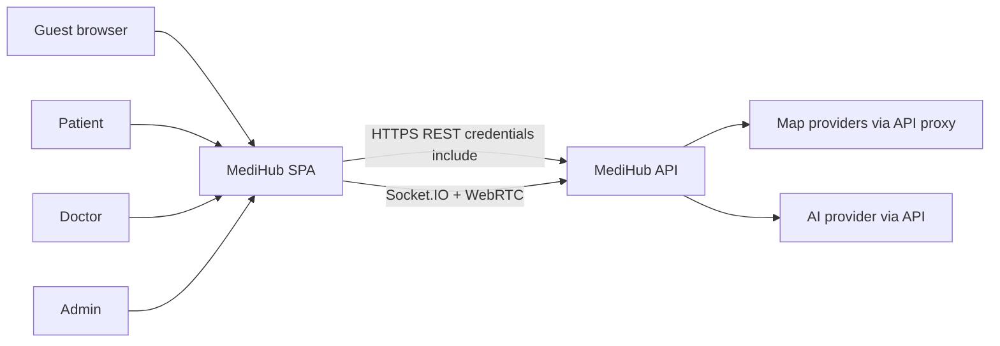

# 1. System context

## 1.1 Purpose

MediHub Frontend is a **single-page application (SPA)** that provides:

- A **public marketing surface** (home with date-filtered network charts, optional splash intro, per-feature pages, role registration, emergency booking, theme & accessibility settings).
- **Role-based dashboards** for patients, doctors, and admins.
- **Live video consultations** with WebRTC (signaled via Socket.IO).
- **Health utilities**: BMI calculator, hospital locator (Leaflet map), AI health chatbot.
- **Clinical workflows**: appointment booking, medical file uploads, prescription approval, live transcript, AI imaging review.

The app does **not** implement business logic on a server of its own. All persistence, AI, maps (Google Places), and file storage run on the **MediHub backend** documented in the root `README.md`.

## 1.2 System boundary

| Inside this repo | Outside this repo |
|------------------|-------------------|
| React UI, routing, form validation | REST API implementation |
| `fetch` + Socket.IO **clients** | Auth cookie issuance, JWT signing |
| WebRTC peer connection in browser | TURN/STUN infrastructure (optional) |
| Client-side PDF vitals parsing (pdf.js) | OCR / server-side STT |
| Chart aggregation for dashboards | Database, Cloudinary, Gemini keys |
| Bearer token in `sessionStorage` | Refresh token HttpOnly cookie (set by API) |

## 1.3 External actors



## 1.4 User roles

| Role | `User.role` | Primary dashboard home | Server enforces |
|------|-------------|------------------------|---------------|
| Patient | `patient` | `/dashboard/patient` | Patient appointment APIs |
| Doctor | `doctor` | `/dashboard/doctor` | Doctor profile, slots, notes |
| Admin | `admin` | `/dashboard/admin` | Pending doctor verification |

The UI uses **`DashboardRoleGate`** for routes that must not be visible to other roles (e.g. AI chatbot and BMI for patient/admin only; not doctors).

Registration and login use the **same** auth endpoints; role is chosen at register (`role` field) or determined by existing account at login.

## 1.5 Communication channels

### REST (`fetch`)

- Base URL from `getMedihubFetchBase()` in `src/lib/config.ts`.
- Protected calls: `credentials: "include"` **and** optional `Authorization: Bearer <token>`.
- JSON bodies use `Content-Type: application/json`.
- Multipart uploads use `FormData` **without** manual `Content-Type`.

### Socket.IO

- URL from `getMedihubSocketUrl()` (same origin in dev proxy mode).
- Auth: `withCredentials: true` + `auth: { token }` when Bearer exists.
- Events: `consultation:join`, `consultation:leave`, `webrtc:offer`, `webrtc:answer`, `webrtc:ice-candidate`.

### WebRTC

- Peer connection created in `src/hooks/useVideoConsultation.ts`.
- ICE servers from `VITE_WEBRTC_ICE_SERVERS` or public STUN defaults in `src/lib/webrtc/iceServers.ts`.
- Media: `getUserMedia({ video: true, audio: true })`.

## 1.6 Local development topology

When `VITE_MEDIHUB_SAME_ORIGIN=true`:

```txt
Browser http://localhost:3000
    │
    ├─ GET/POST /api/*  ──proxy──► VITE_MEDIHUB_SERVER
    └─ WS /socket.io/*  ──proxy──► VITE_MEDIHUB_SERVER
```

Configured in `vite.config.ts`. This allows **Strict SameSite** cookies to work during local dev while the real API runs on another port (e.g. `:4000`).

OAuth redirect URLs still use the **real** backend origin (`assertMedihubServerOrigin()`), not the proxy path.

## 1.7 Related repositories

- **MediHub backend** (separate repo): owns all `/api/*` routes, Socket.IO server, secrets.
- **This repo**: consumer of that contract; `IMPLEMENTED_FEATURES_API_GAPS.md` tracks UI features ahead of README.
