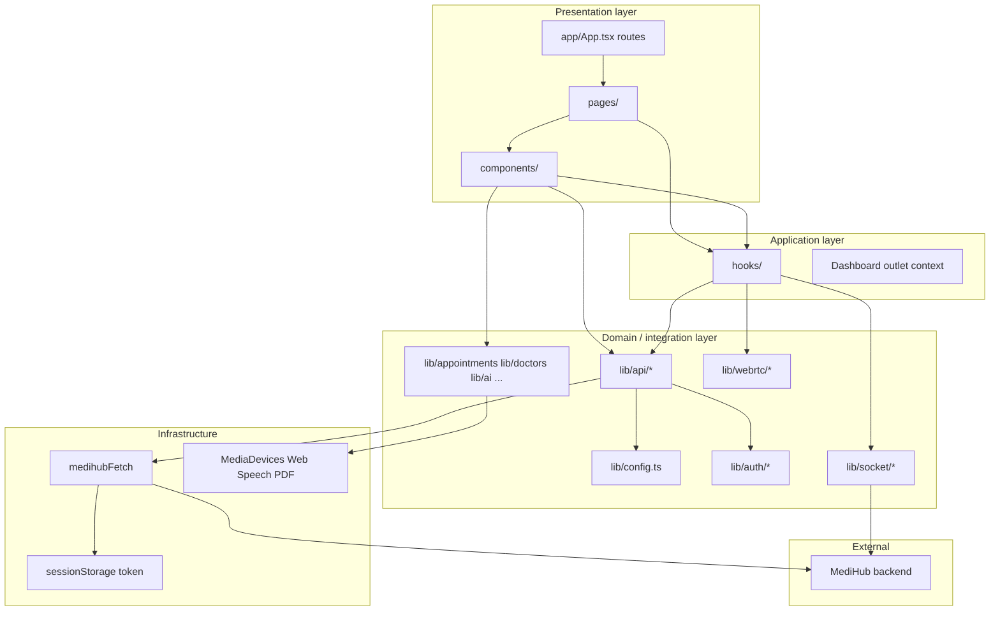
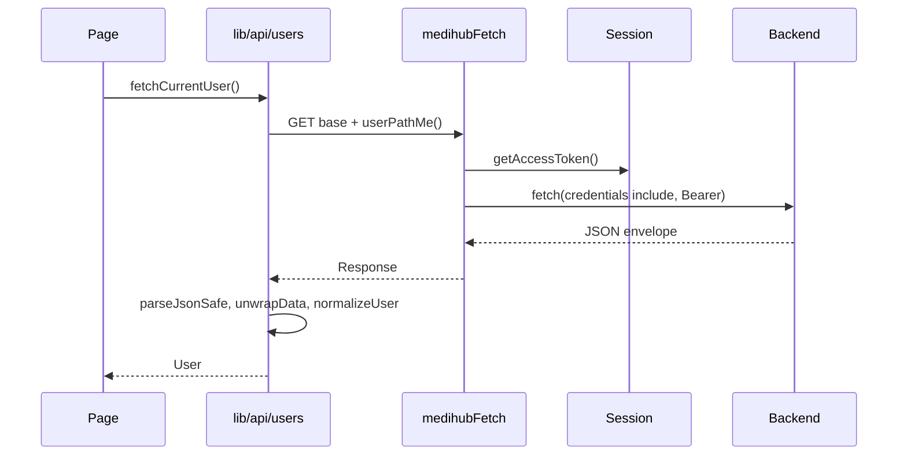

# 3. Layered design

## 3.1 Layer diagram

## 3.2 Layer responsibilities

### Presentation (`src/app`, `src/pages`, `src/components`)

- **Routes and composition only** — minimal business logic.
- Pages load data in `useEffect` or event handlers, then pass props to components.
- **Route files** (`*Route.tsx`) are thin wrappers; **page files** (`*Page.tsx`) hold UI.

### Application (`src/hooks`, outlet context)

- Reusable **orchestration**: video consult lifecycle, appointment polling, notification polling.
- **Dashboard outlet context** (`pages/dashboard/context/outletContext.ts`): `{ user, setUser, refreshUser }` shared by nested dashboard routes.

### Domain / integration (`src/lib`)

Split into:

| Area | Location | Responsibility |
|------|----------|----------------|
| HTTP endpoints | `lib/api/` | One function per API operation; throws on failure |
| Path config | `lib/config.ts` | Env-driven URL builders |
| Auth helpers | `lib/auth/` | Token storage, register validation, portal role |
| Pure domain | `lib/appointments/`, `lib/doctors/`, `lib/bmi/`, etc. | Normalize API shapes, filters, client-side parsing |
| Real-time | `lib/socket/`, `lib/webrtc/` | Socket factory, ICE config |
| Analytics | `lib/analytics/` | Chart datum builders (no server analytics SDK) |

### Types (`src/types`)

- DTO interfaces aligned with API JSON.
- No runtime validation library (Zod/Yup) — validation lives in `lib/auth/registerValidation.ts` and doctor profile validators.

## 3.3 Dependency rules

1. **`types/`** must not import from `pages/`, `components/`, or `hooks/`.
2. **`lib/api/`** may import `lib/config`, `lib/auth/session`, `types/`, `lib/userMessages`.
3. **`components/`** may import `lib/`, `hooks/`, `types/` — not other feature pages.
4. **`pages/`** may import anything under `src/` except circular page imports.
5. **Barrel re-exports** at `lib/api/index.ts` and `lib/appointments/index.ts` — prefer `@/lib/api` in app code.

## 3.4 Request lifecycle (typical protected read)

## 3.5 Error handling convention

1. Network failures detected in `medihubFetch` → user-friendly `NETWORK_ERROR` from `lib/userMessages.ts`.
2. HTTP error bodies → `formatApiFailure()` or `unwrapData()` message.
3. Pages catch and set local `error` state or rely on `DashboardLayout` redirect to login.
4. **Sanitization:** `sanitizeUserFacingMessage()` strips stack traces and internal paths from API messages.

## 3.6 State management strategy

| State type | Mechanism |
|------------|-----------|
| Auth user (dashboard) | `DashboardLayout` + outlet context |
| Access token | `sessionStorage` key `medihub_access_token` |
| Form state | `useState` in page/component |
| Server lists | `useState` + refetch after mutations |
| Consult video | `useVideoConsultation` refs for PC, streams, socket |
| Transcript | Local state + PATCH doctor-notes on interval |

No global event bus. Doctor notifications use `useDoctorNotifications` hook with polling.

## 3.7 Legacy compatibility shims

Several **3-line re-export files** exist at `src/lib/` root for older import paths:

- `portalRole.ts` → `@/lib/auth/portalRole`
- `registerRoleCopy.ts` → `@/lib/auth/registerRoleCopy`
- `doctorProfileValidation.ts` → `@/lib/doctors/profileValidation`
- `appointmentNormalize.ts` → `@/lib/appointments/normalize`
- Duplicate pages under `src/pages/` (e.g. `LoginPage.tsx` re-exporting `auth/LoginPage`)

New code should use the canonical paths under `auth/`, `doctors/`, `appointments/`.
