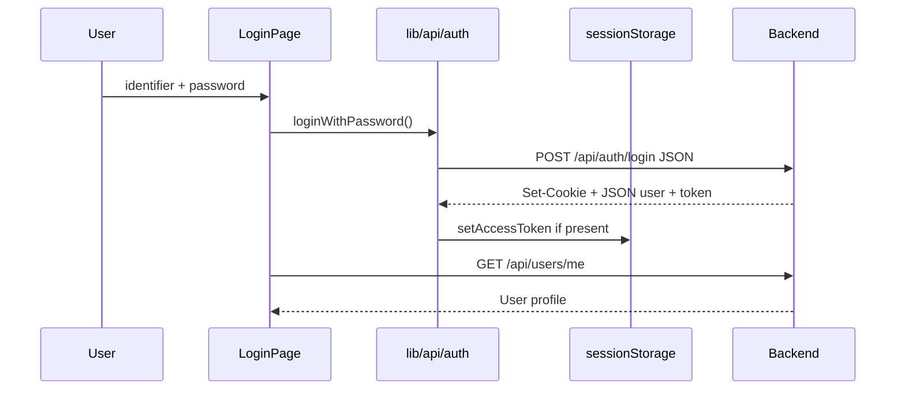

# 6. Authentication and session

MediHub uses a **dual-credential** model optimized for cross-origin SPAs:

1. **HttpOnly cookies** (refresh + optional session) via `credentials: "include"`.
2. **Bearer access token** in `sessionStorage` when the API returns JWT in JSON.

## 6.1 Credential flow diagram



## 6.2 Token storage (`lib/auth/session.ts`)

| Key | Storage | Lifetime |
|-----|---------|----------|
| `medihub_access_token` | `sessionStorage` | Tab session; cleared on logout |

Functions:

- `getAccessToken()` / `setAccessToken()` / `clearAccessToken()`
- `extractAccessTokenFromAuthResponse(body)` — scans many common JSON shapes (`accessToken`, `token`, nested `tokens`, etc.)
- `extractAccessTokenFromUrl(search, hash)` — OAuth callback query/hash params

**Security note:** Access token in `sessionStorage` is visible to XSS. The app must not inject untrusted scripts. Prefer HttpOnly cookies when same-site deployment allows relying on cookies alone.

## 6.3 HTTP auth attachment (`lib/api/client.ts`)

Every `medihubFetch` call:

```ts
const token = getAccessToken();
if (token) headers.set("Authorization", `Bearer ${token}`);
return fetch(input, { ...init, headers });
```

Protected calls also pass `credentials: "include"` from the API module (auth, users, appointments, etc.).

## 6.4 Registration

### Patient / admin (`RegisterPage`)

1. Client validation: `lib/auth/registerValidation.ts` (`RegisterFormValues`).
2. `registerAccount()` builds `FormData` with README-required fields including `photo` file.
3. `POST` to `authPathRegister()` (default `/api/auth/register`).
4. On success: extract token, return `normalizeUser(data)`.

### Doctor (`DoctorRegisterPage` / combined flow)

1. Same account registration with `role: doctor`.
2. Immediately `createDoctorProfile()` → `POST` multipart to `doctorPathMe()`.
3. If step 2 fails, account exists; user can complete profile later at `/dashboard/doctor-profile`.

Multipart doctor fields documented in README and `lib/doctors/doctorMeForm.ts`.

## 6.5 Login

- Endpoint: `authPathLogin()` → `/api/auth/login`.
- Body: `{ identifier, password }` (email, username, or combined identifier per backend).
- UI: `pages/auth/LoginPage.tsx` supports `?returnTo=` and `?portal=` for UX copy only.

## 6.6 Logout

- `logout()` → `POST authPathLogout()` with credentials.
- Always `clearAccessToken()` locally even if network fails.
- `DashboardLayout.handleLogout` navigates to `/login`.

## 6.7 Token refresh

`AuthTokenRefresh` component + `refreshAuthToken()`:

- `POST authPathRefresh()` with `credentials: "include"`.
- On success, updates Bearer via `extractAccessTokenFromAuthResponse`.
- Interval: **15 minutes** while session active.

Backend must accept refresh cookie; same endpoint for all roles (see README).

## 6.8 OAuth / social login

- Start URL: `buildOAuthStartUrl(provider)` in `lib/api/server.ts` uses `assertMedihubServerOrigin()` + paths `authPathGoogle()` etc.
- Redirect URI: `VITE_OAUTH_REDIRECT_URL` (default app route `/auth/callback`).
- Callback page parses token from URL and stores via `setAccessToken`, then fetches user.

## 6.9 Session resolution in dashboard

`DashboardLayout` calls `fetchCurrentUser()` → `GET userPathMe()`.

`normalizeUser()` in `lib/api/users.ts` maps API fields to `User` type (`types/auth.ts`).

Outlet context exposes `refreshUser()` for profile pages after PATCH.

## 6.10 Authorization vs authentication

| Layer | Mechanism |
|-------|-----------|
| **Authentication** | Cookies + Bearer; `fetchCurrentUser` |
| **Route authorization (UI)** | `DashboardRoleGate`, sidebar visibility |
| **Authorization (enforced)** | Backend returns 403 on wrong role — UI shows error |

The frontend **never** trusts role from localStorage alone; role comes from `/api/users/me` after auth.

## 6.11 Failure modes

| Symptom | UI behavior |
|---------|-------------|
| 401 on `/users/me` | Redirect login with `returnTo` |
| Missing `VITE_MEDIHUB_SERVER` | `assertMedihubServerConfigured()` throws; connection message |
| CORS without credentials | Network error message from `userMessages` |
| Expired access token | Refresh interval; manual re-login if refresh fails |
