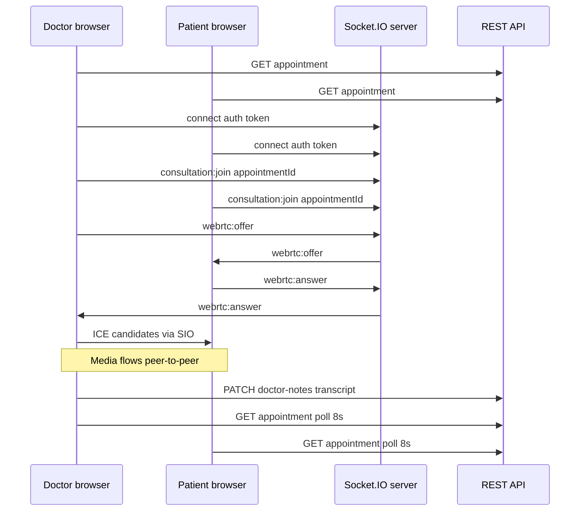

# 9. Real-time consultation (Socket.IO + WebRTC)

Video visits use **WebRTC** for media and **Socket.IO** for signaling. Appointment metadata (files, prescription) still uses REST, with **polling** for sync.

## 9.1 Architecture



## 9.2 Socket client (`lib/socket/consultation.ts`)

### `createConsultationSocket()`

```ts
io(getMedihubSocketUrl(), {
  withCredentials: true,
  auth: token ? { token } : undefined,
  transports: ["websocket", "polling"],
  reconnection: true,
  reconnectionAttempts: 5,
});
```

### `joinConsultationRoom(socket, appointmentId)`

- Emits `consultation:join` with `{ appointmentId }`.
- Expects ack: `{ ok, roomName, socketId }` within 15s timeout.

### `leaveConsultationRoom(socket, appointmentId)`

- Emits `consultation:leave` on teardown.

## 9.3 WebRTC hook (`hooks/useVideoConsultation.ts`)

### State exposed

| State / ref | Meaning |
|-------------|---------|
| `status` | `idle` \| `connecting` \| `connected` \| `error` |
| `error` | User-facing message |
| `roomName` | From join ack |
| `muted`, `cameraOff` | Local track toggles |
| `attachLocalVideo`, `attachRemoteVideo` | Ref callbacks for `<video>` |
| `start()`, `hangUp()` | Lifecycle |

### Internals

- **Polite peer** pattern: handles glare when both sides create offers (`politeRef`, `ignoreOfferRef`).
- **ICE:** `getRtcConfiguration()` from `lib/webrtc/iceServers.ts`.
- **Events listened:** `webrtc:offer`, `webrtc:answer`, `webrtc:ice-candidate`.
- **Events emitted:** same, with `appointmentId` on every payload.

Types in `types/consultation.ts`: `WebRtcOfferPayload`, `WebRtcAnswerPayload`, `WebRtcIcePayload`, `ConsultationJoinAck`.

## 9.4 ICE servers (`lib/webrtc/iceServers.ts`)

1. If `VITE_WEBRTC_ICE_SERVERS` is valid JSON array → use as `RTCIceServer[]`.
2. Else default public STUN: `stun:stun.l.google.com:19302`.

Production deployments often need **TURN** for restrictive NAT; configure via env JSON.

## 9.5 UI component (`components/consult/VideoConsultRoom.tsx`)

- Renders local/remote video elements.
- Controls: mute, camera, hang up.
- Passes through hook API from parent consult pages.

## 9.6 Appointment polling (`hooks/useConsultAppointmentPoll.ts`)

| Consumer | `enabled` when | Purpose |
|----------|----------------|---------|
| Doctor consult | `callConnected === true` | See patient uploads during live call |
| Patient consult | on consult page | See approved prescription |

- Interval: **8000 ms** default.
- Best-effort: errors swallowed to avoid UI flicker.

## 9.7 Live transcription (`hooks/useConsultationTranscription.ts`)

- Uses **Web Speech API** (`SpeechRecognition` / `webkitSpeechRecognition`).
- Appends lines with timestamps via `lib/consult/transcript.ts`.
- Auto-saves to server: `PATCH .../doctor-notes` with `meetingTranscript`.
- **Browser support:** Chrome/Edge; not available in all Safari/Firefox builds.

No audio upload to server for STT.

## 9.8 Doctor consult composition

`DoctorConsultPage` combines:

1. `VideoConsultRoom` + `useVideoConsultation`
2. `DoctorConsultClinicalPanel` — transcript, notes, AI draft, prescription approve
3. `MedicalScanViewer` — AI imaging on patient uploads (when live)
4. `DocumentVitalsIntake` — PDF vitals
5. `useConsultAppointmentPoll` + `useConsultationTranscription`

## 9.9 Patient consult composition

`PatientConsultPage`:

- Video room (join same Socket room).
- `ConsultMedicalUpload` → `POST .../reports`.
- `PatientConsultPrescriptionCard` — shows prescription from polled detail.

## 9.10 Failure modes

| Issue | Mitigation in UI |
|-------|------------------|
| Socket auth failure | `status: error`, message to re-login |
| Join timeout (15s) | Reject promise, show error |
| No camera permission | `getUserMedia` error surfaced |
| ICE failure | User message to check network/TURN |
| Peer disconnected | Connection state → reconnect or hang up |

## 9.11 Dev proxy

With `VITE_MEDIHUB_SAME_ORIGIN=true`, Vite proxies `/socket.io` WebSocket to backend (`vite.config.ts` `ws: true`). Socket URL becomes `window.location.origin`.
