# MediHub Frontend — Complete Architecture (Single Reference)

> **One document** for the full MediHub Vite + React SPA: structure, data flow, routes, auth, APIs, real-time consult, and feature domains — with diagrams throughout.
>
> **API contract:** [README.md](../../README.md) · **Backend gaps:** [IMPLEMENTED_FEATURES_API_GAPS.md](../../IMPLEMENTED_FEATURES_API_GAPS.md)

---

## Table of contents

1. [System overview](#1-system-overview)
2. [Technology stack](#2-technology-stack)
3. [Layered architecture](#3-layered-architecture)
4. [Repository map](#4-repository-map)
5. [Routing & navigation](#5-routing--navigation)
6. [Authentication & session](#6-authentication--session)
7. [HTTP API layer](#7-http-api-layer)
8. [Domain modules](#8-domain-modules)
9. [Real-time video consult](#9-real-time-video-consult)
10. [UI components & state](#10-ui-components--state)
11. [Data models](#11-data-models)
12. [End-to-end user flows](#12-end-to-end-user-flows)
13. [Cross-cutting concerns](#13-cross-cutting-concerns)

---

## 1. System overview

### 1.1 What this application is

MediHub Frontend is a **client-only SPA** that provides:

| Surface | Users | Capabilities |
|---------|-------|--------------|
| **Public** | Guests | Home (network charts + feature cards), splash intro, about, per-feature pages (AI, BMI, hospital locator), role registration, emergency booking, theme & accessibility settings |
| **Patient dashboard** | `patient` | Profile, book visits, medical library, AI chat, BMI, hospital map, video consult |
| **Doctor dashboard** | `doctor` | Professional profile, slots, appointments, notifications, live consult + clinical tools |
| **Admin dashboard** | `admin` | Verify doctors, manage slots, view bookings, hospital locator |

All persistence, AI, maps (Google Places), and file storage live on the **MediHub backend** (separate repo).

### 1.2 System context diagram

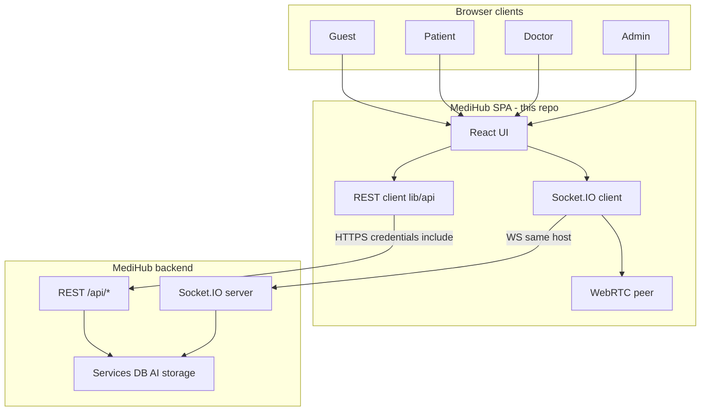

### 1.3 Trust boundary

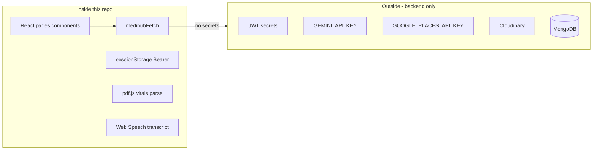

### 1.4 Local dev topology

When `VITE_MEDIHUB_SAME_ORIGIN=true`, Vite proxies API and WebSocket to the real backend:

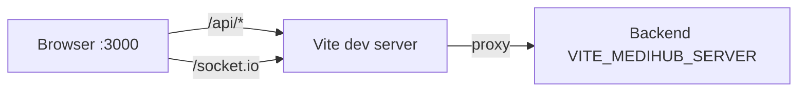

| Mode | `getMedihubFetchBase()` | `getMedihubSocketUrl()` |
|------|-------------------------|-------------------------|
| Cross-origin | Full `VITE_MEDIHUB_SERVER` | Same |
| Same-origin dev | `""` (relative `/api`) | `window.location.origin` |

**Entry:** `src/main.tsx` → `ThemeProvider` → `SettingsProvider` → `src/app/App.tsx` · **Alias:** `@/*` → `src/*` · **Dev port:** `3000`

---

## 2. Technology stack

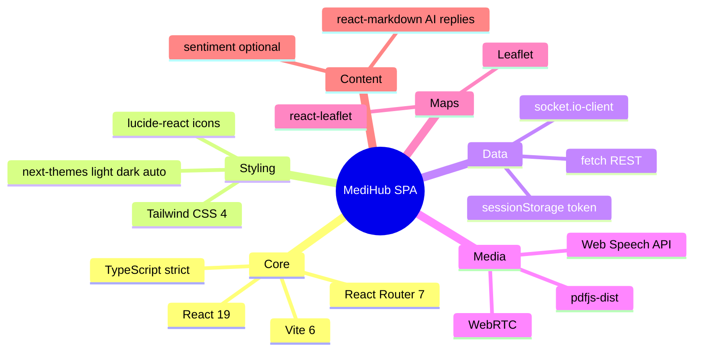

| Layer | Packages | Config |
|-------|----------|--------|
| Build | `vite`, `@vitejs/plugin-react`, `tsc -b` | `vite.config.ts`, `tsconfig.app.json` |
| Lint | `eslint` | `eslint.config.js` |
| Env | `VITE_*` only | `.env.example`, `src/lib/config.ts` |

**Not used:** Redux, React Query, Next.js SSR, MUI/Chakra, external analytics SDK.

---

## 3. Layered architecture

### 3.1 Layer stack (top → bottom)

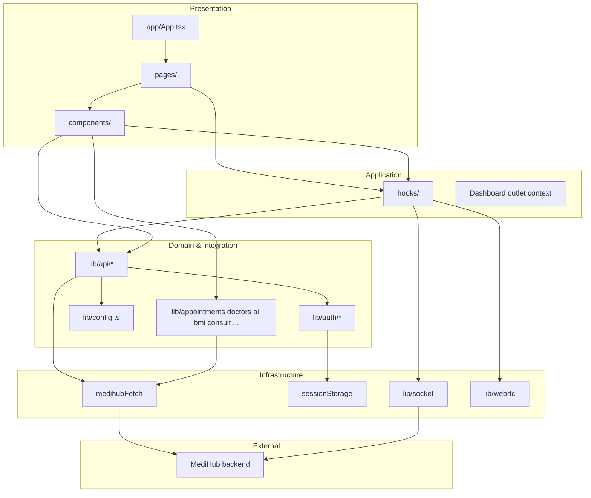

### 3.2 Dependency rules

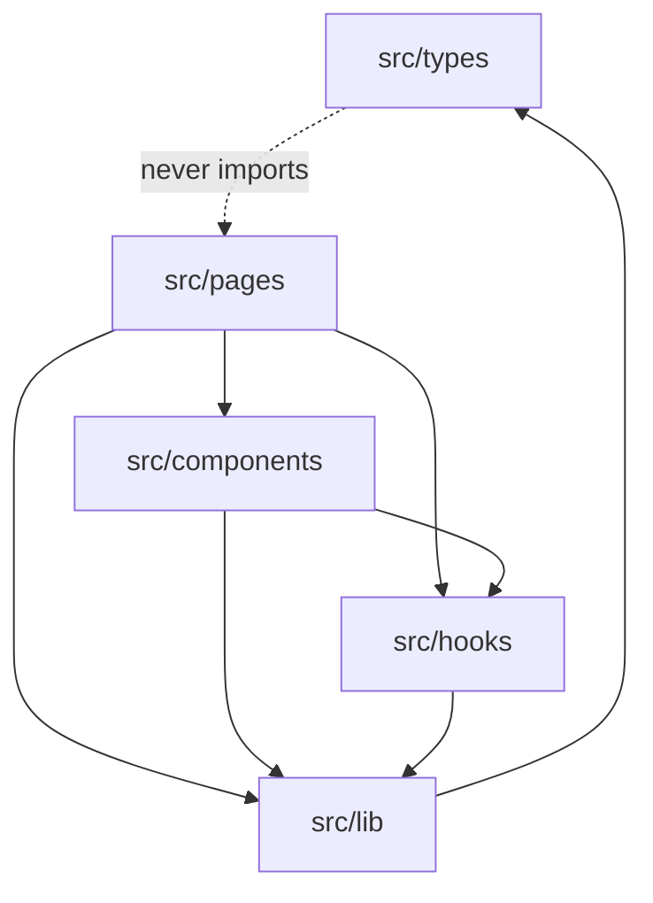

### 3.3 Typical request lifecycle

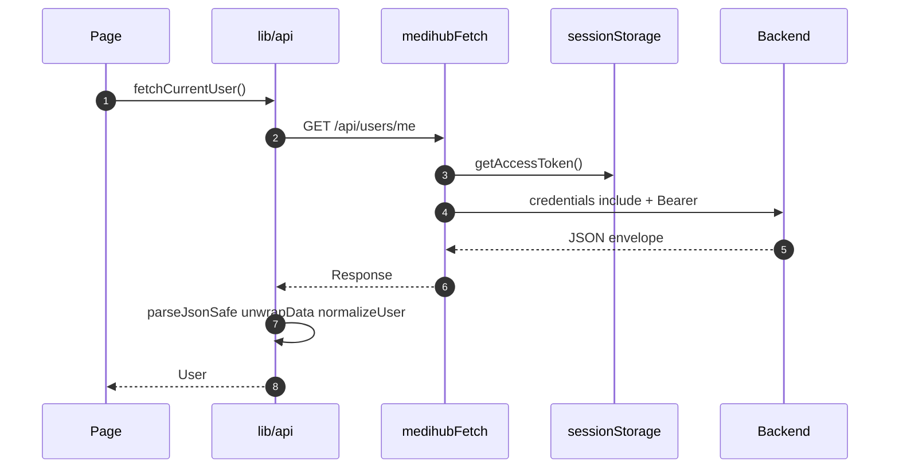

---

## 4. Repository map

### 4.1 High-level tree

```txt
medihub-frontend/
├── src/
│   ├── main.tsx                 # React mount + ThemeProvider + SettingsProvider
│   ├── app/App.tsx              # Route tree
│   ├── contexts/SettingsContext.tsx  # Shared accessibility prefs
│   ├── pages/                   # Route screens (public, auth, dashboard/*)
│   ├── components/              # Feature UI (layout, doctor, consult, charts, settings, …)
│   ├── hooks/                   # useVideoConsultation, poll, notifications
│   ├── styles/theme-and-a11y.css    # Dark mode + a11y global overrides
│   ├── lib/
│   │   ├── api/                 # REST wrappers (auth, users, appointments, …)
│   │   ├── auth/                # session, register validation, portal role
│   │   ├── appointments/        # normalize, vitals, medical archive
│   │   ├── analytics/             # charts, dateRange, networkSnapshots
│   │   ├── public/                # intro session, feature route metadata
│   │   ├── doctors/ ai/ bmi/ consult/ socket/ webrtc/
│   │   └── config.ts            # VITE paths + server URL helpers
│   └── types/                   # DTO interfaces
├── docs/architecture/           # This document
├── vite.config.ts               # Proxy, @ alias, port 3000
└── package.json
```

### 4.2 Feature → folder map

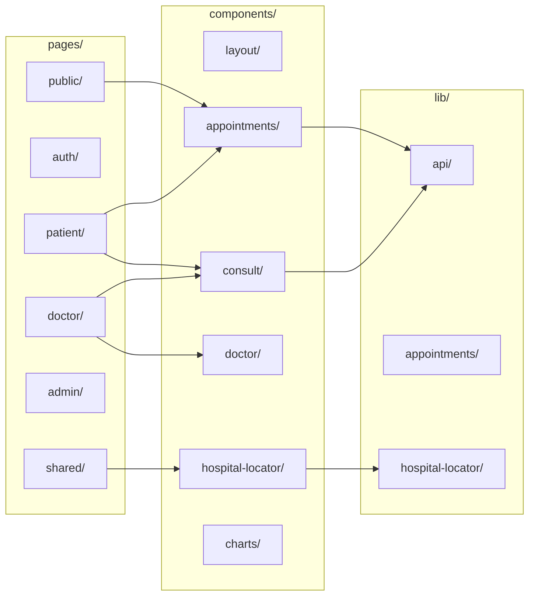

### 4.3 `lib/api/` modules

| File | Domain |
|------|--------|
| `client.ts` | `medihubFetch`, envelope parsing |
| `auth.ts` | register, login, logout, refresh |
| `users.ts` | profile, photo, password |
| `doctors.ts` | doctor me, public list, documents |
| `admin.ts` | pending doctors, verify |
| `appointments.ts` | slots, book, detail, notes, files, cancel, restore, `fetchPublicAppointmentsForAnalytics` |
| `ai-chat.ts` | chats, messages, attachments |
| `bmi.ts` | BMI info + calculate |
| `hospital-locator.ts` | nearby hospitals |
| `index.ts` | barrel `@/lib/api` |

---

## 5. Routing & navigation

### 5.1 Full route tree

```mermaid
flowchart TD
  Root[RootLayout]
  Root --> Home["/ HomePage charts + features"]
  Root --> Splash["/splash heart loader"]
  Splash -->|after ~2.8s| Home
  Root --> About[/about optional]
  Root --> HomeAlias[/home alias → HomePage]
  Root --> Portals[/portals role registration]
  Root --> FeatAI[/features/ai-assistant]
  Root --> FeatBMI[/features/bmi-buddy]
  Root --> FeatHosp[/features/hospital-locator]
  Root --> Emerg[/emergency]
  Root --> Login[/login]
  Root --> Reg[/register]
  Root --> RegR[/register/:role]
  Root --> OAuth[/auth/callback]

  Dash[DashboardLayout /dashboard]
  Dash --> Redirect{path = /dashboard?}
  Redirect -->|yes| RoleHome[role home]

  Dash --> PatHome[/patient]
  Dash --> PatProf[/patient/profile]
  Dash --> PatAppt[/patient/appointments]
  Dash --> PatDet[/patient/appointments/:id]
  Dash --> PatCon[/patient/consult/:id]
  Dash --> PatMed[/patient/medical-records]

  Dash --> DocHome[/doctor]
  Dash --> DocAppt[/doctor/appointments]
  Dash --> DocDet[/doctor/appointments/:id]
  Dash --> DocCon[/doctor/consult/:id]
  Dash --> DocSlot[/doctor/slots]
  Dash --> DocNotif[/doctor/notifications]
  Dash --> DocProf[/doctor-profile]

  Dash --> AdmHome[/admin]
  Dash --> AdmPen[/admin/pending-doctors]
  Dash --> AdmAppt[/admin/appointments]
  Dash --> AdmSlot[/admin/manage-slots]
  Dash --> AdmProf[/admin/profile]

  Dash --> Gate{DashboardRoleGate}
  Gate --> Chat[/chatbot patient admin]
  Gate --> BMI[/bmi-buddy patient admin]
  Gate --> Hosp[/hospital-locator patient admin]

  Catch["/*"] --> LoginRedirect[/login]
```

### 5.2 Role → home path

```mermaid
flowchart LR
  ME[GET /api/users/me] --> Role{user.role}
  Role -->|patient| PH[/dashboard/patient]
  Role -->|doctor| DH[/dashboard/doctor]
  Role -->|admin| AH[/dashboard/admin]
```

| Helper | Location | Purpose |
|--------|----------|---------|
| `dashboardHomePath(role)` | `lib/dashboardPaths.ts` | Default home per role |
| `safeDashboardReturnTo(qs)` | same | Post-login redirect whitelist |
| `DashboardRoleGate` | `components/layout/` | Block wrong roles from shared tools |

### 5.3 Public first-visit flow

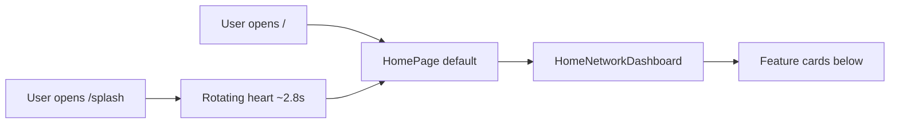

- **`/`** is the default landing route (`HomePage`) — care network charts and feature cards.
- **`/splash`** is optional branding; after the loader it navigates to **`/`** (not `/about`). `sessionStorage` key `medihub-intro-complete` is set so repeat splash visits skip the animation when configured.
- **`/about`** remains available from the public navbar for marketing copy.

### 5.4 Sidebar by role (dashboard)

**Layout:** **Left sidebar** on desktop (`lg+`); **hamburger** opens a left `Sheet` with the full nav on small screens (no bottom tab bar). **Settings** (theme + accessibility) in the sidebar footer and header gear icon.

| Role | Nav items (high level) |
|------|------------------------|
| **Patient** | Home, Profile, BMI, Appointments, Notifications, Visit documents, My uploads, Chatbot, Hospital locator |
| **Doctor** | Workspace, Professional profile, Slots, Appointments, Notifications |
| **Admin** | Home, Pending doctors, Manage slots, Bookings, Profile, Hospital locator |

Doctors do **not** get BMI / chatbot / hospital locator in sidebar.

### 5.5 Dashboard auth gate

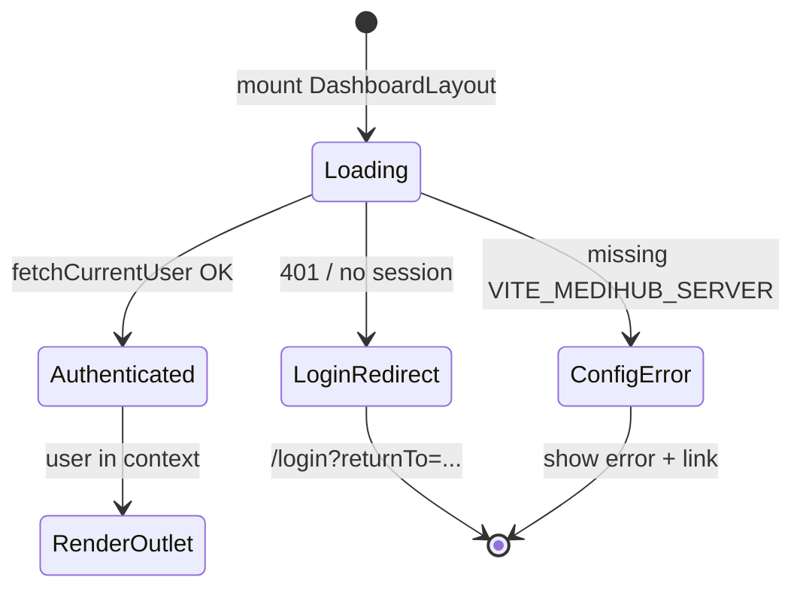

---

## 6. Authentication & session

### 6.1 Dual credential model

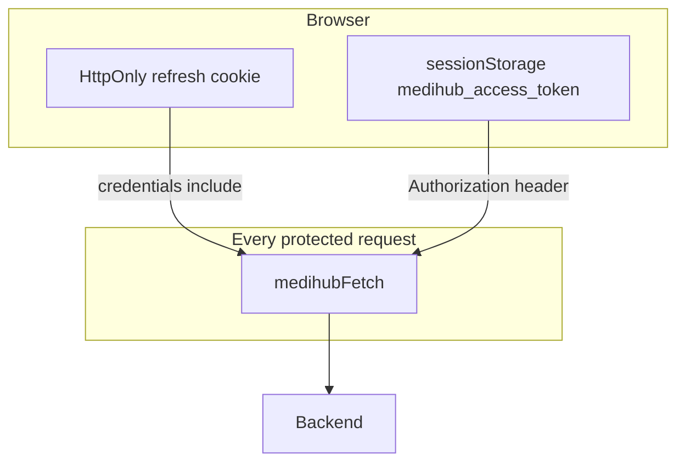

### 6.2 Login sequence

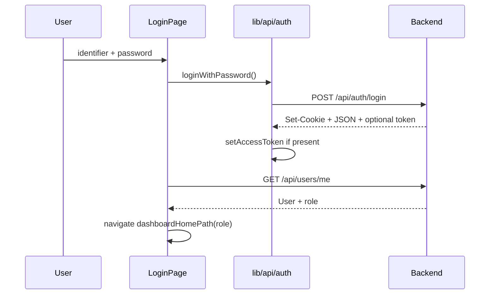

### 6.3 Registration flows

```mermaid
flowchart TD
  subgraph patient_admin [Patient / Admin]
    R1[RegisterPage multipart] --> R2[POST /api/auth/register]
    R2 --> R3[Dashboard home]
  end

  subgraph doctor [Doctor]
    D1[DoctorRegisterPage] --> D2[POST /api/auth/register role doctor]
    D2 --> D3[POST /api/doctors/me multipart]
    D3 -->|fail| D4[Account exists finish at doctor-profile]
    D3 -->|ok| D5[/dashboard/doctor]
  end
```

### 6.4 Token refresh (background)

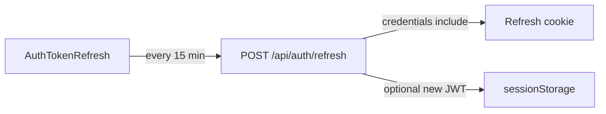

| Concern | Implementation |
|---------|----------------|
| Storage key | `medihub_access_token` in `sessionStorage` |
| Extract token | `extractAccessTokenFromAuthResponse`, `extractAccessTokenFromUrl` |
| Logout | `clearAccessToken` + `POST /api/auth/logout` |
| OAuth | `buildOAuthStartUrl` → `/auth/callback` |

---

## 7. HTTP API layer

### 7.1 Client pipeline

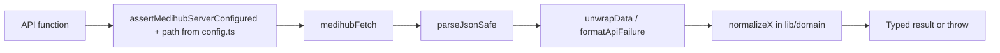

### 7.2 Envelope format

```json
{
  "success": true,
  "statusCode": 200,
  "message": "Success",
  "data": { }
}
```

Error: `{ "success": false, "message": "...", "errors": [] }`

### 7.3 API surface map

```mermaid
flowchart TB
  subgraph public [Public REST]
    Health[/api/health]
    BMI[/api/bmi-buddy/*]
    Docs[/api/doctors]
    Slots[/api/appointments/doctors/:id/slots]
    Hosp[/api/hospital-locator/nearby]
  end

  subgraph protected [Protected REST]
    Auth[/api/auth/*]
    User[/api/users/me/*]
    Dr[/api/doctors/me/*]
    Appt[/api/appointments/*]
    AI[/api/ai/chats/*]
    Adm[/api/doctors/admin/*]
  end

  Client[lib/api/*] --> public
  Client --> protected
```

### 7.4 Multipart vs JSON

| Use case | Content-Type | Set manually? |
|----------|--------------|---------------|
| Login | `application/json` | Yes |
| Register, photo, reports, doctor docs | `multipart/form-data` | **No** — browser sets boundary |
| Profile PATCH | `application/json` | Yes |

---

## 8. Domain modules

### 8.1 Module dependency graph

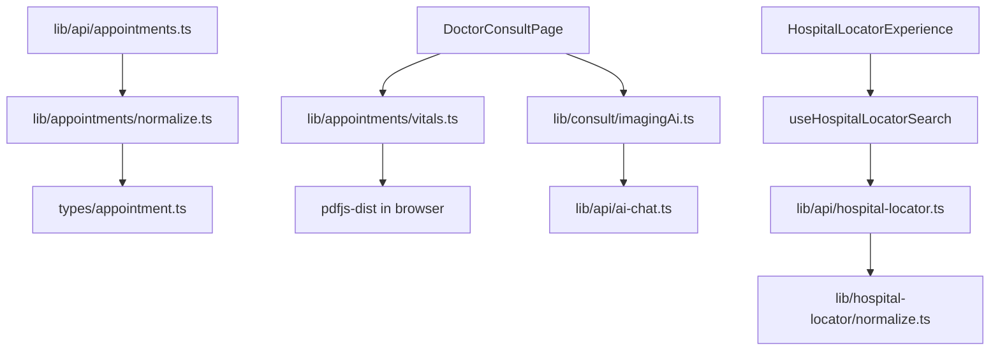

### 8.2 Appointments domain

| Module | Responsibility |
|--------|----------------|
| `normalize.ts` | API → `PatientAppointment`, `AppointmentDetail` |
| `vitals.ts` | PDF/text → vitals struct (client-only) |
| `medicalArchive.ts` | N+1 detail fetch → library groups |
| `notifications.ts` | API + synthesized notifications |
| `slots.ts`, `filters.ts`, `status.ts` | UI helpers |

### 8.3 Hospital locator pipeline

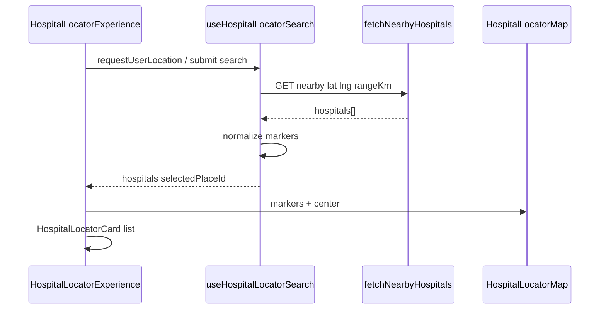

### 8.4 AI & consult imaging

```mermaid
flowchart LR
  Scan[MedicalScanViewer] --> ImgAI[imagingAi.ts]
  ImgAI --> Attach[sendAiChatMessageWithAttachments]
  Attach --> Vision[Backend vision model]

  Chat[AiChatPage] --> Msg[sendAiChatMessage]
  Msg --> LLM[Backend AI chat]
```

No dedicated `POST .../analyze-imaging` — uses AI Chat attachments (see API gaps doc).

---

## 9. Real-time video consult

### 9.1 Consult stack overview

```mermaid
flowchart TB
  subgraph rest [REST - appointment state]
    GET[GET /appointments/:id]
    PATCH[PATCH doctor-notes transcript]
    POST[POST reports / ai-draft / prescription]
    Poll[Poll every 8s useConsultAppointmentPoll]
  end

  subgraph realtime [Real-time - media]
    SIO[Socket.IO consultation:join]
    SIG[webrtc offer answer ice]
    RTC[RTCPeerConnection]
    Media[getUserMedia]
  end

  DocPage[DoctorConsultPage] --> rest
  DocPage --> realtime
  PatPage[PatientConsultPage] --> rest
  PatPage --> realtime
```

### 9.2 WebRTC signaling sequence

```mermaid
sequenceDiagram
  participant D as Doctor
  participant S as Socket.IO server
  participant P as Patient

  D->>S: connect auth token
  P->>S: connect auth token
  D->>S: consultation:join appointmentId
  P->>S: consultation:join appointmentId
  D->>S: webrtc:offer
  S->>P: webrtc:offer
  P->>S: webrtc:answer
  S->>D: webrtc:answer
  D->>S: webrtc:ice-candidate
  S->>P: webrtc:ice-candidate
  Note over D,P: Media peer-to-peer
```

### 9.3 Hook & file map

| Piece | File |
|-------|------|
| Socket factory | `lib/socket/consultation.ts` |
| WebRTC lifecycle | `hooks/useVideoConsultation.ts` |
| ICE config | `lib/webrtc/iceServers.ts` + `VITE_WEBRTC_ICE_SERVERS` |
| Video UI | `components/consult/VideoConsultRoom.tsx` |
| Live transcript | `hooks/useConsultationTranscription.ts` (Web Speech API) |
| Appointment sync | `hooks/useConsultAppointmentPoll.ts` |

### 9.4 Doctor consult panel composition

```mermaid
flowchart TB
  DCP[DoctorConsultPage]
  DCP --> VCR[VideoConsultRoom]
  DCP --> CLIN[DoctorConsultClinicalPanel]
  DCP --> SCAN[MedicalScanViewer]
  DCP --> VIT[DocumentVitalsIntake]

  CLIN --> TR[Live transcript PATCH]
  CLIN --> AI[generateAppointmentAiDraft]
  CLIN --> RX[approveAppointmentPrescription]
  SCAN --> IMG[imagingAi via AI Chat]
  VIT --> PDF[vitals.ts pdf.js]
```

---

## 10. UI components & state

### 10.1 App-wide providers (`main.tsx`)

| Provider | Package / file | Purpose |
|----------|----------------|---------|
| `ThemeProvider` | `next-themes` · `components/providers/ThemeProvider.tsx` | Light / dark / system (`class` on `<html>`) |
| `SettingsProvider` | `contexts/SettingsContext.tsx` | Accessibility toggles persisted in `localStorage` (`medihub-a11y`) |

Global effects: `styles/theme-and-a11y.css` remaps common Tailwind utilities under `html.dark` and applies large-text, high-contrast, reduce-motion, enhanced-focus classes on `<html>`.

### 10.2 Component families

```mermaid
flowchart TB
  subgraph layout [layout/]
    RL[RootLayout + PublicNavbar + PublicFooter]
    DL[DashboardLayout left sidebar]
    DRG[DashboardRoleGate]
  end

  subgraph settings [settings/]
    SSP[SettingsSheet]
    ASP[AppSettingsPanel]
  end

  subgraph features [Feature components]
    Appt[appointments/]
    Doc[doctor/]
    Con[consult/]
    Hosp[hospital-locator/]
    Adm[admin/]
    Pub[public/ HomeNetworkDashboard]
  end

  subgraph viz [charts/]
    Pie[AnalyticsPieChart]
    Bar[AnalyticsBarChart]
    CDF[ChartDateFilter per chart]
  end

  DL --> DRG
  RL --> SSP
  pages --> layout
  pages --> features
  pages --> viz
  viz --> CDF
```

### 10.3 State management map

```mermaid
flowchart LR
  subgraph global_dashboard [Dashboard scope]
    DL[DashboardLayout user state]
    Ctx[Outlet context user setUser refreshUser]
  end

  subgraph page_local [Page scope]
    useState[useState lists forms errors]
    useEffect[useEffect fetch on mount]
  end

  subgraph consult [Consult scope]
    Refs[useVideoConsultation refs streams PC]
    Poll[useConsultAppointmentPoll]
    Trans[useConsultationTranscription]
  end

  DL --> Ctx
  pages --> useState
  pages --> useEffect
  consult --> Refs
```

**No Redux / React Query** — refetch after mutations manually.

### 10.4 Charts & date-filtered analytics

**Home (public):** `HomeNetworkDashboard` on `HomePage` (`/`).

| Chart | Data source | Date filter |
|-------|-------------|-------------|
| Doctors per hospital | `fetchPublicDoctors` or `fetchPublicAppointmentsForAnalytics` | Per-chart `ChartDateFilter` |
| Specialty at hospital | Same | Per-chart range |
| Specialties network-wide | Same | Per-chart range |
| Bookings by status | Appointments (when API allows) | Per-chart range |
| Bookings over time | `appointmentsByDay` | Per-chart range |
| Visits by time of day | `appointmentsByTimeSlot` | Per-chart range |

**Helpers:** `lib/analytics/dateRange.ts` (presets + custom range), `lib/analytics/networkSnapshots.ts` (daily doctor-profile snapshots in `localStorage` when booking API is unavailable).

**Dashboard (authenticated):** `DoctorDashboardCharts`, `AdminDashboardCharts` — appointment lists via `fetchMyAppointments` / `fetchAdminAppointments`.

```mermaid
flowchart LR
  API[fetchPublicDoctors + fetchPublicAppointmentsForAnalytics] --> Norm[normalize]
  Norm --> Analytics[appointmentAnalytics + networkAnalytics]
  Analytics --> Filter[ChartDateFilter per panel]
  Filter --> Charts[ChartPanel + AnalyticsBarChart / PieChart]
  Snap[networkSnapshots localStorage] --> Charts
```

---

## 11. Data models

### 11.1 Core entities (conceptual ER)

```mermaid
erDiagram
  USER ||--o| DOCTOR_PROFILE : has
  USER ||--o{ APPOINTMENT : books_or_hosts
  DOCTOR_PROFILE ||--o{ SLOT : offers
  APPOINTMENT ||--|| SLOT : uses
  APPOINTMENT ||--o{ PATIENT_REPORT : contains
  APPOINTMENT ||--o{ DOCTOR_FILE : contains
  USER ||--o{ AI_CHAT : owns

  USER {
    string _id
    string role
    string email
    string photo
  }
  DOCTOR_PROFILE {
    string specialization
    number experienceYears
    string hospitalName
  }
  APPOINTMENT {
    string status
    string meetingTranscript
    string approvedPrescription
  }
```

### 11.2 TypeScript files

| File | Types |
|------|-------|
| `types/auth.ts` | `User`, `ApiEnvelope`, `PortalRole` |
| `types/appointment.ts` | `PatientAppointment`, `AppointmentDetail`, slots, notifications |
| `types/doctor.ts` | Doctor profile, documents |
| `types/aiChat.ts` | Chat threads, messages |
| `types/consultation.ts` | WebRTC / Socket payloads |
| `types/hospital.ts` | Nearby hospital DTOs |
| `types/bmi.ts` | BMI plans |
| `types/vitals.ts` | Extracted lab vitals |

Normalization: `unknown` API JSON → strict types via `lib/*/normalize.ts`.

---

## 12. End-to-end user flows

### 12.1 Book appointment (patient)

```mermaid
flowchart TD
  A[Open appointments / home doctors] --> B[fetchPublicDoctors]
  B --> C[Select doctor]
  C --> D[fetchDoctorSlots]
  D --> E[BookAppointmentPanel]
  E --> F[bookAppointment slotId symptoms]
  F --> G[Appointment detail / list]
```

### 12.2 Admin verify doctor

```mermaid
flowchart TD
  A[/admin/pending-doctors] --> B[fetchAdminPendingDoctors]
  B --> C[PendingDoctorCard review]
  C --> D[verifyAdminDoctor status docs]
  D --> E[Refresh list]
```

### 12.3 Live consult (combined)

```mermaid
flowchart TD
  Start[Open consult/:appointmentId] --> Load[fetchAppointmentById]
  Load --> Join[Socket consultation:join]
  Join --> Media[getUserMedia + WebRTC]
  Media --> Live{Call connected?}

  Live -->|Doctor| T[Transcription PATCH transcript]
  Live -->|Patient| U[Upload reports POST]
  Live --> Both[Poll GET appointment 8s]

  T --> Draft[POST ai-draft]
  Draft --> Approve[PATCH prescription approve]
  Approve --> Both
```

### 12.4 Medical library (patient)

```mermaid
flowchart TD
  A[/patient/medical-records] --> B[GET /appointments/me]
  B --> C[For each visit GET /appointments/:id]
  C --> D[medicalArchive.ts group files Rx]
```

> **Note:** N+1 pattern — optional backend `GET /appointments/me/archive` would optimize.

### 12.5 Restore cancelled visit (doctor)

```mermaid
flowchart TD
  A[Cancelled list / detail] --> B[PATCH restore-by-doctor]
  B -->|404 405 501| C[Fallback PATCH doctor-notes status scheduled]
  B -->|200| D[Refresh appointments]
  C --> D
```

---

## 13. Cross-cutting concerns

### 13.1 Error handling

```mermaid
flowchart TD
  E[Error thrown] --> Net{Network failure?}
  Net -->|yes| NE[NETWORK_ERROR message]
  Net -->|no| API{API body?}
  API -->|yes| SF[sanitizeUserFacingMessage]
  API -->|no| FB[fallback string]
  NE --> UI[Page / Layout display]
  SF --> UI
  FB --> UI
```

| Module | Role |
|--------|------|
| `lib/userMessages.ts` | Central copy, sanitization |
| `lib/api/client.ts` | `isLikelyNetworkFailure`, `formatApiFailure` |

### 13.2 Environment variables (client-safe)

| Variable | Required | Purpose |
|----------|----------|---------|
| `VITE_MEDIHUB_SERVER` | Yes | Backend origin |
| `VITE_MEDIHUB_SAME_ORIGIN` | No | Dev proxy `/api` + `/socket.io` |
| `VITE_*_PATH` | No | Override REST paths (`config.ts`) |
| `VITE_OAUTH_REDIRECT_URL` | No | OAuth callback |
| `VITE_HERO_VIDEO_URL` | No | Home hero video |
| `VITE_WEBRTC_ICE_SERVERS` | No | JSON ICE servers |

**Never in frontend:** `GEMINI_API_KEY`, `GOOGLE_PLACES_API_KEY`, MongoDB URI, JWT secrets.

### 13.3 Security checklist

```mermaid
flowchart LR
  S1[No secrets in bundle] --> S2[HttpOnly refresh cookie]
  S2 --> S3[Bearer in sessionStorage]
  S3 --> S4[safeDashboardReturnTo]
  S4 --> S5[Backend enforces role 403]
  S5 --> S6[Medical files via backend URLs only]
```

### 13.4 Build & deploy

```mermaid
flowchart LR
  Dev[npm run dev] --> Vite[Vite :3000]
  Build[npm run build] --> TSC[tsc -b]
  TSC --> Dist[dist/ static]
  Dist --> CDN[Static host + SPA fallback]
```

### 13.5 Related documentation

| Topic | Link |
|-------|------|
| REST API contract | [README.md](../../README.md) |
| UI vs API gaps | [IMPLEMENTED_FEATURES_API_GAPS.md](../../IMPLEMENTED_FEATURES_API_GAPS.md) |
| Missing APIs checklist | [docs/api/MISSING_REQUIRED_APIS.md](../api/MISSING_REQUIRED_APIS.md) |
| Local setup | [docs/setup/local-environment.md](../setup/local-environment.md) |
| Production | [docs/production/deployment-steps.md](../production/deployment-steps.md) |

### 13.6 Contributor checklist (new feature)

```mermaid
flowchart TD
  N1[Add route in app/App.tsx] --> N2[Add page under pages/]
  N2 --> N3[Add lib/api function + config path]
  N3 --> N4[Add types + normalizer]
  N4 --> N5[Build UI in components/]
  N5 --> N6[Update this ARCHITECTURE.md if new pattern]
```

---

## Quick reference card

| Item | Value |
|------|-------|
| Entry | `src/main.tsx` → `src/app/App.tsx` |
| API import | `@/lib/api` |
| Config | `src/lib/config.ts` |
| Auth token | `sessionStorage` key `medihub_access_token` |
| Dashboard context | `useOutletContext<DashboardOutletContext>()` |
| Consult signaling | Socket.IO on same host as API |
| Default poll interval | 8 seconds |
| Auth refresh interval | 15 minutes |

---

*Last updated: 2026-05-17 — home default with date-filtered network charts, left dashboard sidebar + mobile hamburger, theme/a11y settings, splash → home flow, and split public feature routes.*
